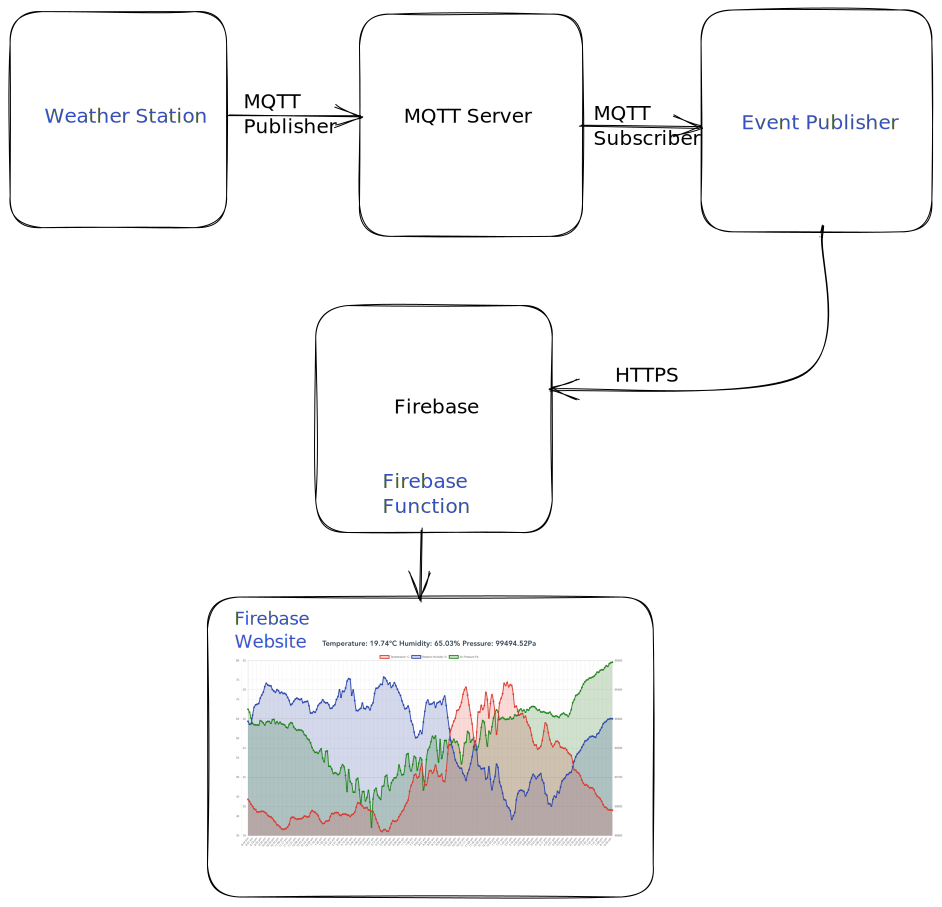
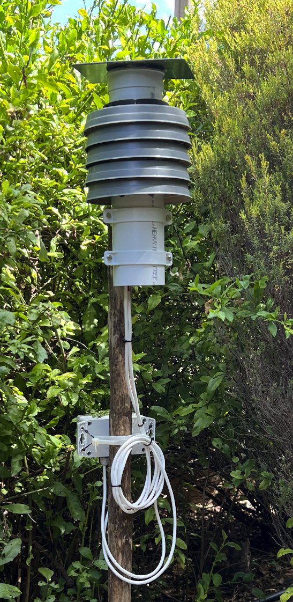

# Weather

This contains the workings for a home weather station. The aim is to host as little as possible.

The project assumes you at least have an MQTT server that is reachable by the weather station. In my case I use [mosquitto](https://mosquitto.org/).

The project has 4 Parts:

- Weather Station
- Event Publisher
- Firebase Function
- Firebase Website

## Weather Station

### BOM

- [Feather M0](https://learn.adafruit.com/adafruit-feather-m0-wifi-atwinc1500)
- [Battery](https://www.robotics.org.za/105570)
- [Solar Pannel](https://www.robotics.org.za/6V35W)
- [Solar LIPO Charger](https://www.robotics.org.za/CN3065)
- [BME280 Sensor](https://www.waveshare.com/bme280-environmental-sensor.htm)
- 5 x [Plastic Pot Saucer](https://www.gropak.co.za/products/plastic-pot-saucer-grey?variant=40585358311521)
- Small piece of 80mm PVC downpipe
- 2 x 80mm downpipe holders
- Enclosure 65x115x55mm IP65 rated

### [Code](./arduino/)

Connects to a WIFI AP and periodically sends all sensor data to an MQTT server.

## [Event Publisher](./cmd/publisher/)

Listens for MQTT events and publishes it to firebase.

## [Firebase Function](./functions)

Used to host an API to filter the last 24h of data for the website to use.

## [Firebase Website](./website/)

Pulls the latest data and displays it on a graph.

## Known Issues

- Page takes long to load.
- Page does not auto refresh
- No night mode
- It can look better
